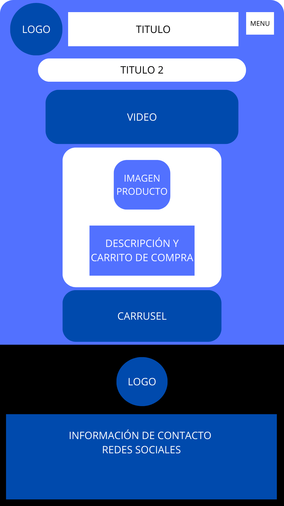

Cable Venta

Descripción General
Cable Venta es una aplicación web para la venta de cables y productos eléctricos. 
Los usuarios pueden explorar una variedad de productos destacados y añadirlos a su carrito de compras. 
La página principal incluye una sección de productos destacados, y hay páginas adicionales para información sobre la empresa y el carrito de compras.

Estado del Proyecto
El proyecto está actualmente en desarrollo. Se están realizando mejoras en la interfaz de usuario y la funcionalidad del carrito de compras. 
Los próximos cambios incluirán la integración de un sistema de pago y la mejora de la experiencia de usuario en dispositivos móviles.

Requisitos del Entorno de Desarrollo
HTML5
CSS3

Guía de Instalación y Funcionamiento
Clonar el repositorio:
git clone https://github.com/usuario/cable-venta.git

Navegar al directorio del proyecto:
cd cable-venta

Abrir el archivo index.html en un navegador web:
open index.html

Para ver las otras páginas, navegue a las siguientes URLs:
Página principal: index.html

Quiénes Somos: Html/quienes_somos.html

Carrito de Compras: Html/carrito_de_compras.html

Tecnologías Utilizadas
HTML5: Para la estructura de las páginas web.
CSS3: Para el diseño y la presentación visual.

Colaboración
Los colaboradores son bienvenidos. Para contribuir:

Haga un fork del repositorio.
Cree una nueva rama (git checkout -b feature-nueva-funcionalidad).
Haga commit de sus cambios (git commit -m 'Añadir nueva funcionalidad').
Haga push a la rama (git push origin feature-nueva-funcionalidad).
Abra una solicitud de pull en GitHub.
Para reportar problemas o bugs:

Use la sección de "Issues" en GitHub.

Bugs Conocidos y Posibles Correcciones
Problema: La página no se adapta correctamente en algunos dispositivos móviles.
Solución: Mejorar el CSS para incluir más consultas de medios y pruebas en diversos dispositivos. 

Preguntas Frecuentes (FAQ)
¿Cómo añado un producto al carrito de compras?

Haga clic en el botón "AÑADIR AL CARRITO" junto al producto deseado.
¿Cómo puedo contactar con el soporte?

Utilice la sección de contacto en la página de "Quiénes Somos" o envíe un correo a info@ventacable.com.co.
